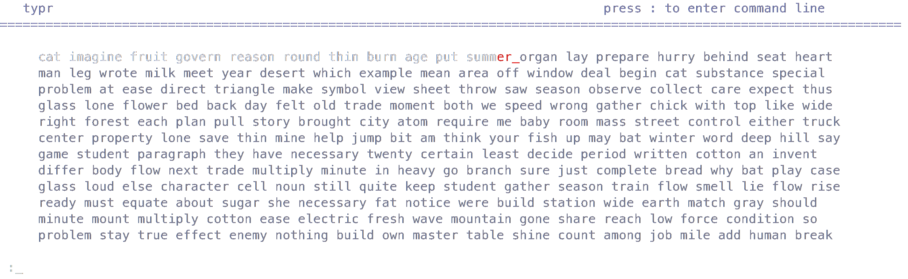

# ⌨️ typr
_`typr`_ is a program for improving typing speed. It's designed to be fast and lightweight, written in C++ using __curses__ library for GNU/Linux.

# ⚙️ customization 
_`typr`_ is customizable: words, colors, sizes..
To change the settings use command line by pressing __colon__
Here is the list of all available commands:

| name | description |
|-----|-----|
| `ldc` or `loadconfig` | Used to load/re-load config files 
| `ldw` or `loadwords {name}`| Used to load/re-load words file, _name_ parameter is optional, if not provided, will load latest loaded/saved file, if no files were used, defaults to "words"
| `svw` or `savewords {name}` | Used to overwrite save words file, similarly to `ldw`, if no argument given, picks latest used file or default
| `nw` or `newwords {name}` | Used to create a new empty wordset, optional name, similar to `ldw`, creating new words will erase all current words, don't forget to __save__!
| `addw` or `addwords {words...}` | Used to add new words to the list, optional number of arguments, __duplicates are skipped__
| `rmw` or `removewords {words...}` | Used to remove words from the list, optional number of arguments
| `ts` or `testsize {n}` | Used to change size of the test, in words
| `c` or `color {group} {r} {g} {b}` | Used to change color profiles for letters. Argument _group_ is one of the 4 profiles: <ul> <li> typed or `t`: color of the correctly typed letters </li> <li> error or `e`: color of the incorrectly typed letters </li> <li> predicted or `p`: color of the letters to be typed </li> <li> interface or `i`: color of the interface </li> </ul> `{r}`, `{g}` or `{b}` arguments are (red, green, blue) color components, __in range 0 .. 1000__
| `m` or `mode {mode}` | Used to change typing mode to one of the following: <ul> <li>relaxed or `r`: default mode, errors are highlighted </li> <li> strict or `s`: hard mode, test ends on error </li> <li> forgiving or `f`: light mode, ignores errors </li> </ul>
| `r` or `reset` | Used to create new test

__Put files in the `~/.config/typr`__

# 📈 Scalability
If you're a developer and want to bring your customization and individualization on a next level, you can create your own front-end for the app! 
Feel free to look at the [base view class](https://github.com/sgp729/typr/src/base_view.h) to inherit in your works.

__Please report any issues encountered!__
